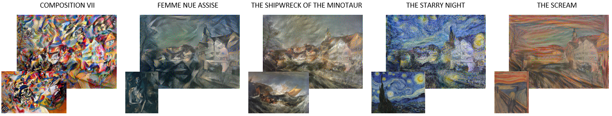

# Reimplementation of the Paper 'A Neural Algorithm of Artistic Style' (2015)

Reimplementation of artistic style transfer by Marisa Wodrich and Johanna Linkemeyer for the course 'Implementing Artificial Neural Networks with TensorFlow'. The original paper by Leon A. Gatys, Alexander S. Ecker and Matthias Bethge can be found [here](https://arxiv.org/abs/1508.06576).

## Introduction
Artistic style transfer aims at transferring the style of a given image to an artistic style. It allows to take any photopraph and any artistic work one likes and creates a version of that photograph in the style (meaning the same colors, brushstroke, and art specific patterns) of the specific artwork. The example image used in the original paper by Gatys and colleagues are an image of the Neckarfront in Tübingen as a content image and the following artworks by famous artists:
* Composition VII by Wassily Kadinsky (1913) *- Abstract Art*
* Femme Nue Assise by Pablo Picasso (1910) *- Cubism*
* The Starry Night by Vincent van Gogh (1889) *- Post-Impressionism*
* The Scream by Edvard Munch (1893) *- Expressionism*
* The Shipwreck of the Minotaur by William Turner (1810) *- Romantic*

Our replication results of the artistic style transfer on the combinations of the original paper can be seen in the following figure. For further results and experiments on other content and style images, we would like to refer to our paper which can be found [here](https://github.com/marisawodrich/style-transfer/blob/main/replication_paper/style_transfer_not_finished.pdf).

## File Structure
* main.py \ functions to run the style transfer on one or more combinations
* model.py \ contains the class for our model (StyleModel) and the specific loss functions
* processing.py \ functions for pre- and postprocessing
* helpers.py \  helper functions to create image directories, load images, test and call processing functions
* visualize.py \ functions to visualize images, adaption progress and other plots

## Running the Style Transfer

We provide a Google Colab version, a Jupyter Notebook and a local version with a proper file structure. We would highly recommend to use the Google Colab version as the code is put into context with the original paper there and the style transfer process is sped up using the free GPU provided by Google.
We were not able to test our local version using a GPU, so adaptions might be necessary there. However, there should be no issues running the code on CPU, although we would not recommend it as the optimization process can take very long without a GPU. We tested the environment setup on Windows machines.
1. [Colab](https://colab.research.google.com/drive/1QyBRdjDXfPIMuP-nY-vcj8sMbqkp2viM#scrollTo=gS0RpbSgFcXb)
2. Local (You should have Anaconda or Miniconda installed):
    * Create a new conda environment with python version 3.7.10 uring the following command (please adapt NAME to your preferred environment name)
      * conda create --name NAME python=3.7.10
    * Activate the environment using with the following command
      * conda activate NAME
    * Go to the directory (PATH) you would like this repo to be cloned in
      * cd PATH
    * Run the following commands:
      * git clone https://github.com/marisawodrich/style-transfer.git
      * cd style-transfer
      * pip3 install -r requirements.txt
   
   Run the following command (remain in the 'style-transfer' directory) to run the style transfer locally
   * python main.py
   
   Or, you can take a look at the demo Notebook. Please note that this notebook mimics the structure of the Google Colab we created, however instead of defining the functions, they will be imported at the corresponding positions. They could be loaded all at once in the beginning, but we considered this style to be more readable for the user, as this way, the functions are loaded where they are actually used.
   Run the following command and then, in your preferred browser in the jupyter overview, select the 'demo.ipynb' file.
   * jupyter notebook

## References
* Paper
* Colab 1
* Colab 2
